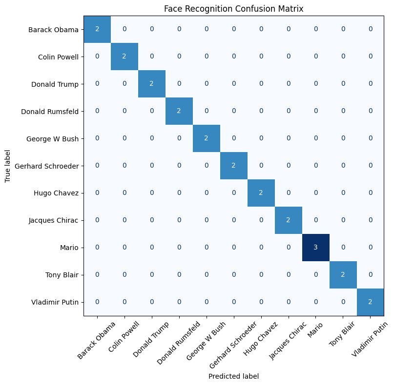
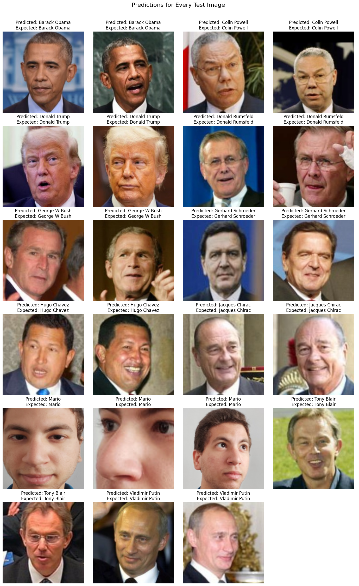
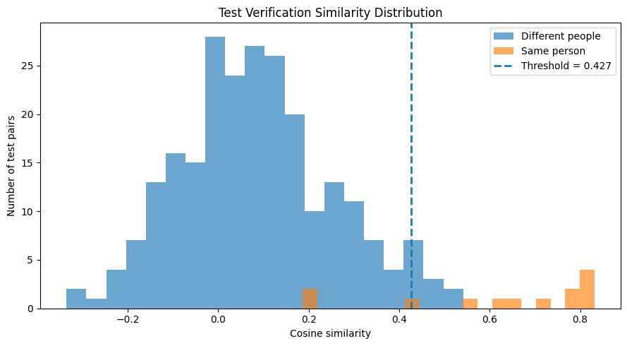

# Face Recognition with FaceNet

A face-recognition and face-verification project using pretrained FaceNet embeddings, a linear SVM classifier, and cosine similarity.

## Overview

The dataset contains **111 face images across 11 identities**. Faces are detected and prepared with OpenCV, converted into 128-dimensional FaceNet embeddings, and used for identity classification and face verification.

## Results

| Metric | Result |
|---|---:|
| Training images | 88 |
| Held-out test images | 23 |
| Mean repeated cross-validation accuracy | 98.876% |
| Test accuracy | 100.000% |
| Correct test predictions | 23/23 |
| Verification pair accuracy | 96.443% |
| Verification balanced accuracy | 90.849% |

### Held-Out Predictions

The classifier correctly identified all 23 images in the held-out test set.

### Face Verification

The verification threshold was selected using training-image pairs and evaluated separately on held-out test pairs.

## Workflow

1. Detect and prepare faces using OpenCV.
2. Generate embeddings using pretrained FaceNet.
3. Train a normalized linear SVM classifier.
4. Evaluate using repeated stratified cross-validation and a held-out test set.
5. Verify whether two images contain the same person using cosine similarity.

## Technologies

Python, TensorFlow, Keras, FaceNet, OpenCV, scikit-learn, NumPy, and Matplotlib.

## Notebook

[View the executed Kaggle notebook](https://www.kaggle.com/code/marioyouchia/face-recognition-with-facenet)

## Limitations

The dataset is small and curated, so the results do not represent universal real-world performance. The classifier is closed-set and always predicts one of the known identities. More varied images and unknown-person testing would be required for production use.
